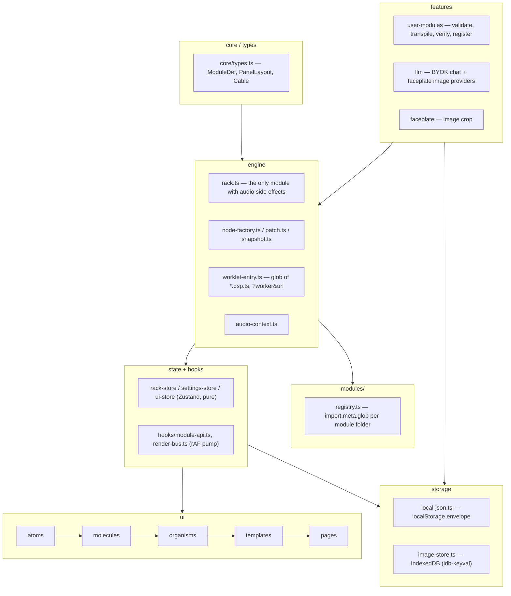

# System Architecture

Signaly is a 2D modular synthesizer that runs entirely in the browser: 40 built-in Eurorack-style
modules, patch cables, presets, and a BYOK LLM module builder. No backend, no accounts.

## Stack

Runtime dependencies only: **react** 19, **react-dom** 19, **zustand** 5, **sucrase** 3,
**idb-keyval** 6. Build/test tooling: Vite 8, TypeScript 6 (strict, `noUncheckedIndexedAccess`),
Vitest 4, ESLint 10 + typescript-eslint, Prettier 3. Nothing else ships to the browser.

## Layers

## Invariants

- **Audio nodes live on `ModuleInstance`, outside React.** `engine/types.ts`'s `ModuleInstance`
  holds `node`, `jacks`, `natives`, `cvGains`, `ext` — React never clones or re-renders through it.
- **The store is pure; only `engine/rack.ts` has audio side effects.** `rack-store.ts` holds plain
  row/module/cable data. `addModule`, `connectCable`, `setParam`, etc. in `rack.ts` are the sole
  callers of `AudioContext`/`AudioWorkletNode` APIs.
- **One cable per input jack.** `connectCable` in `rack.ts` disconnects any existing cable on the
  destination jack before wiring the new one.
- **Attenuverter is a `GainNode` on `attenuates` inputs.** `installCvAttenuverters` in
  `node-factory.ts` inserts a `GainNode` between a CV input's own jack and its module target when
  `KnobDef.attenuates` names that jack; `rack.setParam` drives the gain directly and the knob value
  never reaches the DSP.
- **Per-frame data never enters React state.** Scopes, meters, and cable geometry are drawn off a
  single `requestAnimationFrame` pump in `hooks/render-bus.ts` (`addDraw`/`runDraws`), started
  lazily on first subscriber and stopped when the last one leaves.
- **Worklet bundle is loaded via `?worker&url`.** `audio-context.ts` imports
  `worklet-entry.ts?worker&url` — `new URL(..., import.meta.url)` is documented as broken under a
  Vite build (the raw `.ts` ships as an asset and the glob never expands).
- **Rows have fixed HP capacity.** `settings.rowWidthHp` (default 120, 20–208, user-adjustable) is
  enforced by `fits()` in `rack.ts`: `addModule`/`duplicateModule`/`moveModule` are refused when the
  target row lacks free HP; the last refusal reason is exposed via `getLastRowRejection()`.

## Module contract

A module is a folder under `src/modules/<id>/`, picked up by `modules/registry.ts` via
`import.meta.glob('./*/*.def.ts', …)` — nothing to register by hand.

| file | purpose |
|---|---|
| `<id>.def.ts` | required. `ModuleDef`: id, name, hp, category, knobs/switches/jacks, `worklet` xor `native`, optional `display` |
| `<id>.dsp.ts` | worklet DSP class extending `Base` (`dsp-prelude.ts`), `registerProcessor(id, Class)` |
| `<id>.native.ts` | alternative to `.dsp.ts` for a plain Web Audio graph (e.g. `mix`, `out`, `scope`) |
| `<id>.panel.ts` | optional. Authored 0..1 `PanelLayout`; `layoutPanel(def)` falls back to a computed grid when absent |
| `<id>.serialize.ts` | optional. `save`/`load`/`validate` for module-specific `ext` state (e.g. `seq`) |
| `<id>.parts.tsx` | optional. Extra React UI beyond the standard panel nodes |

Panel node ids follow a fixed prefix convention: `knob:<id>`, `fader:<id>`, `switch:<id>`,
`in:<jackId>`, `out:<jackId>`, `led:<id>`, `display` (singular), `label:<text>`.

## User-module pipeline

`features/user-modules/runtime-registry.ts` → `registerUserModule(um)`:

1. **Validate** (`validate.ts`/`validate-primitives.ts`) the def shape and `dsp` string.
2. **Transpile** (`dsp-transpile.ts`): sucrase strips TypeScript, a `FORBIDDEN` regex rejects
   `eval`/`Function`/`importScripts`/`fetch`/`window`/`document`/`localStorage`/`globalThis` etc.,
   author `import` lines are stripped, and the real `dsp-prelude.ts` (transpiled once) is inlined
   ahead of the author's code so worklet scope can never drift from the built-in one.
3. **Verify offline**: `dsp-verify.ts` renders the processor in an `OfflineAudioContext`, scanning
   output for NaN/Infinity/out-of-range samples within a timeout.
4. **Load live**: the built code is blobbed and passed to `audioWorklet.addModule(blobUrl)`.
5. **Register**: `registerSpec` adds it to the same registry map as built-ins.

The processor name is bumped on every edit — `user:<slug>@<updatedAt>` — because a live
`AudioContext` can never un-register a processor name.

## BYOK (bring your own key)

One API key per provider (`storage/api-key-store.ts`, Anthropic/OpenAI/Gemini), stored in
`localStorage`. Model ids are fetched from each provider at runtime, never hardcoded. Chat requests
force structured output per provider (`features/llm/providers/`): Anthropic uses a forced tool call,
OpenAI uses `json_schema`, Gemini uses `responseSchema`. No streaming — one request, one parsed
`ModuleProposal`. Faceplate image generation is supported by OpenAI and Gemini only.

## Storage

- **localStorage**, versioned envelope `{ v: 1, data }` (`storage/local-json.ts`), under
  `signaly.*.v1` keys: `patches`, `settings`, `api-keys`, `user-modules`. Malformed or wrong-version
  payloads fall back silently; writes swallow quota/private-mode failures.
- **IndexedDB** (`idb-keyval`, `storage/image-store.ts`) for faceplate image blobs — well past
  localStorage's practical size budget.

## Security boundaries

- CSP (`index.html`): `script-src 'self' blob:` (worklet blobs only), no third-party script origins;
  `connect-src` allow-lists only the three LLM provider APIs.
- API keys and error text are scrubbed (`features/llm/providers/http.ts`'s `scrub`) before ever
  reaching a thrown error or log.
- All imported/stored JSON (patches, user modules, API key state) is validated on read; malformed
  data degrades to a safe default rather than throwing.
- User DSP is never `eval`'d on the main thread — it only ever runs inside an `AudioWorkletProcessor`
  in the audio rendering thread, after the offline verification pass above.
