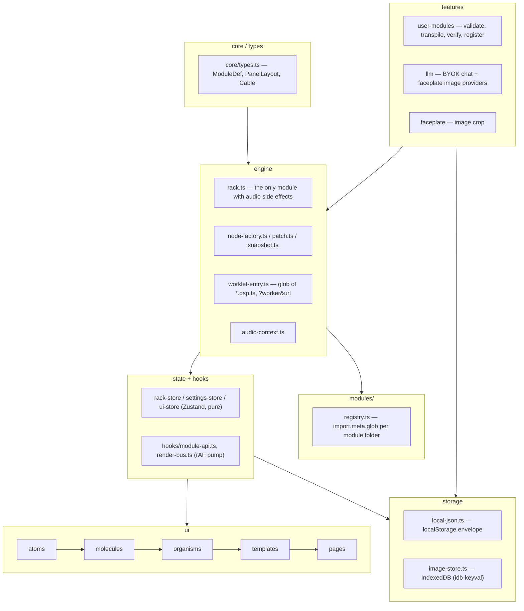

# System Architecture

Signaly is a 2D modular synthesizer that runs entirely in the browser: 71 built-in Eurorack-style
modules, patch cables, saved patches, and a BYOK LLM module builder. No backend, no accounts.

## Stack

Runtime dependencies only: **react** 19, **react-dom** 19, **zustand** 5, **sucrase** 3,
**idb-keyval** 6. Build/test tooling: Vite 8, TypeScript 6 (strict, `noUncheckedIndexedAccess`),
Vitest 4, ESLint 10 + typescript-eslint, Prettier 3. Nothing else ships to the browser.

## Layers

## Invariants

- **Audio nodes live on `ModuleInstance`, outside React.** `engine/types.ts`'s `ModuleInstance`
  holds `node`, `jacks`, `natives`, `cvGains`, `ext` — React never clones or re-renders through it.
- **The store is pure; only `engine/rack.ts` has audio side effects.** `rack-store.ts` holds plain
  row/module/cable data. `addModule`, `connectCable`, `setParam`, etc. in `rack.ts` are the sole
  callers of `AudioContext`/`AudioWorkletNode` APIs.
- **One cable per input jack.** `connectCable` in `rack.ts` disconnects any existing cable on the
  destination jack before wiring the new one.
- **Attenuverter is a `GainNode` on `attenuates` inputs.** `installCvAttenuverters` in
  `node-factory.ts` inserts a `GainNode` between a CV input's own jack and its module target when
  `KnobDef.attenuates` names that jack; `rack.setParam` drives the gain directly and the knob value
  never reaches the DSP.
- **Per-frame data never enters React state.** Scopes, meters, and cable geometry are drawn off a
  single `requestAnimationFrame` pump in `hooks/render-bus.ts` (`addDraw`/`runDraws`), started
  lazily on first subscriber and stopped when the last one leaves.
- **A worklet input cannot tell "no cable" from "a cable carrying silence".** `ch(I, n)` returns
  `null` for an unpatched input but a zero-filled buffer for a patched, silent one. Nothing depends
  on the difference today: MIX 8's returns are aux returns that add into the main bus at their
  level, so an unpatched return and a patched silent one both contribute nothing.
- **Worklet bundle is loaded via `?worker&url`.** `audio-context.ts` imports
  `worklet-entry.ts?worker&url` — `new URL(..., import.meta.url)` is documented as broken under a
  Vite build (the raw `.ts` ships as an asset and the glob never expands).
- **Rows have fixed HP capacity, but adding a module is never blocked.** `settings.rowWidthHp`
  (default 120, 120–240, user-adjustable) is enforced by `fits()` in `rack.ts`. `addModule` and
  `duplicateModule` spawn a new row directly beneath a full one rather than refusing; `moveModule`
  (the drag path) still refuses, because the user aimed at that specific row. The 120 HP floor is
  wider than the widest built-in, so no module is ever unplaceable. See
  `docs/adr/0002-adding-a-module-is-never-blocked-by-a-full-row.md`.

## Module contract

A module is a folder under `src/modules/<id>/`, picked up by `modules/registry.ts` via
`import.meta.glob('./*/*.def.ts', …)` — nothing to register by hand.

| file                | purpose                                                                                                                           |
| ------------------- | --------------------------------------------------------------------------------------------------------------------------------- |
| `<id>.def.ts`       | required. `ModuleDef`: id, name, hp, category, knobs/switches/jacks, `worklet` xor `native`, optional `display`, optional `panel` |
| `<id>.dsp.ts`       | worklet DSP class extending `Base` (`dsp-prelude.ts`), `registerProcessor(id, Class)`                                             |
| `<id>.native.ts`    | alternative to `.dsp.ts` for a plain Web Audio graph (e.g. `mix`, `out`, `scope`)                                                 |
| `<id>.serialize.ts` | optional. `save`/`load`/`validate` for module-specific `ext` state (e.g. `seq`)                                                   |
| `<id>.parts.tsx`    | optional. Extra React UI beyond the standard panel nodes; replaces the `display` node entirely when present                       |

Panel geometry is computed by `layoutPanel(def)` from the definition. There is no per-module
`<id>.panel.ts` file — every one of them was deleted. A built-in may still author its own 0..1
`PanelLayout` as `ModuleDef.panel`, but only as a documented exception (currently `mix8`); see
`docs/adr/0001-panel-geometry-computed-by-default.md`.

Panel node ids follow a fixed prefix convention: `knob:<id>`, `fader:<id>`, `switch:<id>`,
`in:<jackId>`, `out:<jackId>`, `led:<id>`, `display` (singular), `label:<text>`.

## Display contract

`ModuleInstance.ext` is `Record<string, unknown>` — a deliberately untyped escape hatch for audio
objects that must live outside React. It stays untyped: typing it would mean a union of every
module's private state in `engine/types.ts`, which is a worse trade than this table. **This table is
the contract.** `def.display` picks a renderer in `ui/organisms/module-panel-node.tsx`, and each
renderer reads specific `ext` keys or specific worklet feed messages. Nothing enforces the pairing at
compile time, so declaring a `display` without providing its side of the row produces a panel that
renders nothing and reports no error — exactly how the MAIN OUT `SPECTRUM`/`PHASE` switches shipped
wired to an analyser that nothing drew.

| `display` | the module must provide                                                                                                                                                                                                                                                                                            | the renderer reads                                                                                                                                                                                  |
| --------- | ------------------------------------------------------------------------------------------------------------------------------------------------------------------------------------------------------------------------------------------------------------------------------------------------------------------ | --------------------------------------------------------------------------------------------------------------------------------------------------------------------------------------------------- |
| `text`    | native: assign a string to `m.ext.text` in `audio()` and again in `param()` when it changes (`volt`, `voct`). Worklet: post `{ t: 'text', v: string }` (`clock`, `arp`)                                                                                                                                            | `TextDisplay` — copies `msg.v` onto `m.ext.text`, then renders `m.ext.text` when it is a string, else an empty line                                                                                 |
| `steps`   | worklet posts `{ t: 'step', i, n?, pattern? }` (`euklid` sends all three, `seq` sends only `i`). Nothing on `ext`                                                                                                                                                                                                  | `StepsDisplay` — `i` is the playhead LED, `n` the LED count clamped to 1–16 (default 16), `pattern` an `ArrayLike<number>` lighting non-playhead LEDs at 0.45                                       |
| `scope`   | `m.ext.analyser` = an `AnalyserNode` fed by a tap parallel to the audio path (`scope` aliases channel 1, `volt` its single tap)                                                                                                                                                                                    | `ScopeDisplay` — `getFloatTimeDomainData` on `m.ext.analyser` each frame, ÷5 V to normalise; draws an empty screen when the key is missing                                                          |
| `meter`   | one of three, checked in this order: (1) `m.ext.analysis` = `OutAnalysis` **and** switches `spectrum`/`phase` in `def.sws` (`out`); (2) `m.ext.analyserL` + `m.ext.analyserR`, optionally `m.ext.bufL`/`bufR` (`out`); (3) neither, and the worklet posts `{ t: 'meter', in, gr? , open? }` in dB (`comp`, `gate`) | `MeterDisplay` — uses `analysis` only while `m.sws.spectrum === 1 \|\| m.sws.phase === 1`; else the stereo `ChannelMeter` pair when both analysers exist; else `FeedMeter` on the worklet feed      |
| `env`     | knobs with the ids `a`, `d`, `s`, `r` in `def.knobs`, each with a `fmt`. Nothing on `ext`, no feed                                                                                                                                                                                                                 | `EnvPanel` — `useParam(m, 'a'\|'d'\|'s'\|'r')` for the curve and `def.knobs.find(…)?.fmt` for the four chips                                                                                        |
| `piano`   | `m.ext.kbd` = `{ held: number[]; trigOn(note); trigOff(note) }`, written outside React (`kbd`)                                                                                                                                                                                                                     | `PianoDisplay` — polls `m.ext.kbd.held` on the render bus, maps notes to pitch classes; a click calls `trigOn`/`trigOff` on the same object. Missing `kbd` renders all keys off and swallows clicks |

Two related feeds share the same untyped shape. A `led:<id>` panel node lights on
`{ t: 'led', id, v }` and toggles on any `{ t: 'step' }` (`lfo`, `clockdiv`, `seq`, `euklid`). And a
module's `<id>.parts.tsx`, when present, **replaces** the `display` node entirely — `seq` declares a
`display` kind that is never rendered because its parts component takes the slot.

## User-module pipeline

`features/user-modules/runtime-registry.ts` → `registerUserModule(um)`:

1. **Validate** (`validate.ts`/`validate-primitives.ts`) the def shape and `dsp` string.
2. **Transpile** (`dsp-transpile.ts`): sucrase strips TypeScript, a `FORBIDDEN` regex rejects
   `eval`/`Function`/`importScripts`/`fetch`/`window`/`document`/`localStorage`/`globalThis` etc.,
   author `import` lines are stripped, and the real `dsp-prelude.ts` (transpiled once) is inlined
   ahead of the author's code so worklet scope can never drift from the built-in one. The regex is
   defence in depth, not the boundary — see Security boundaries below.
3. **Verify offline**: `dsp-verify.ts` renders the processor in an `OfflineAudioContext`, scanning
   output for NaN/Infinity/out-of-range samples within a timeout. The timeout bounds the UI wait and
   the context is closed afterwards, but a worklet stuck in an infinite loop cannot be pre-empted
   from the main thread; only a reload clears that render thread.
4. **Load live**: the built code is blobbed and passed to `audioWorklet.addModule(blobUrl)`.
5. **Register**: `registerSpec` adds it to the same registry map as built-ins.

The processor name is bumped on every edit — `user:<slug>@<updatedAt>` — because a live
`AudioContext` can never un-register a processor name.

## BYOK (bring your own key)

One API key per provider (`storage/api-key-store.ts`, Anthropic/OpenAI/Gemini), stored in
`sessionStorage` unless `settings.rememberKeys` is on. Model ids are not secret and stay in
`localStorage` either way; keys already in `localStorage` from before the change are kept there and
set `rememberKeys` to true, so nothing on disk is silently orphaned. Gemini's key is sent as the
`x-goog-api-key` header rather than a `?key=` query parameter, keeping it out of devtools and HAR
exports. Every provider request carries an `AbortSignal.timeout`, so a provider that never answers
fails with a deadline message instead of leaving the builder waiting forever. Chat requests
force structured output per provider (`features/llm/providers/`): Anthropic uses a forced tool call,
OpenAI uses `json_schema`, Gemini uses `responseSchema`. No streaming — one request, one parsed
`ModuleProposal`. Faceplate image generation is supported by OpenAI and Gemini only.

## Storage

`storage/local-json.ts` wraps every value in a versioned envelope `{ v: 1, data }` and takes the
`Storage` object as an argument, so one envelope serves both web-storage areas. Malformed,
wrong-version or wrong-shape payloads fall back silently; writes swallow quota/private-mode failures.

| area             | keys                                                                                  | holds                                                                                                                                          |
| ---------------- | ------------------------------------------------------------------------------------- | ---------------------------------------------------------------------------------------------------------------------------------------------- |
| `localStorage`   | `signaly.{patches,settings,user-modules}.v1`, and `signaly.api-keys.v1` for model ids | patches, settings, user-module definitions and DSP source, provider model ids                                                                  |
| `sessionStorage` | `signaly.api-keys.v1`                                                                 | provider API keys — the default, so closing the tab forgets them. They live in `localStorage` instead only while `settings.rememberKeys` is on |
| IndexedDB        | `idb-keyval` store                                                                    | faceplate image blobs                                                                                                                          |

- **The origin, not the app, is the storage boundary.** On GitHub Pages every project site under one
  account shares `https://<user>.github.io`, so a script on any of them can read these keys.
  Session-only keys shrink the window; only a custom domain closes it.
- **IndexedDB** (`idb-keyval`, `storage/image-store.ts`) for faceplate image blobs — well past
  localStorage's practical size budget. `clearImages()` is a plain named export; the "delete
  everything" path calls it instead of dynamically importing `idb-keyval` a second time.

## Security boundaries

- CSP (`index.html`), as shipped: `default-src 'self'`; `script-src 'self' blob:` and
  `worker-src 'self' blob:` (user modules compile in the page and register from a blob URL — that is
  the sandbox, not a hole); `connect-src 'self'` plus exactly the three LLM provider hosts;
  `img-src 'self' blob: data:`; `style-src 'self' 'unsafe-inline'` (React sets styles through CSSOM
  and the app has no HTML sink, so dropping it buys nothing); `object-src 'none'`; `base-uri 'self'`;
  `form-action 'none'`. `frame-ancestors` is deliberately absent: the spec ignores it in a meta CSP
  and browsers warn on every load; it needs a response header, which GitHub Pages cannot send.
- A React error boundary plus `error` / `unhandledrejection` handlers in `main.tsx` turn a render
  exception into a recoverable message rather than a blank page.
- API keys and error text are scrubbed (`features/llm/providers/http.ts`'s `scrub`) before ever
  reaching a thrown error or log.
- All imported/stored JSON (patches, user modules, API key state) is validated on read; malformed
  data degrades to a safe default rather than throwing.
- User DSP is never `eval`'d on the main thread — it only ever runs inside an `AudioWorkletProcessor`
  in the audio rendering thread, after the offline verification pass above.
- **User-DSP threat model, stated plainly.** The sandbox is the AudioWorklet scope (no DOM, no
  network by spec) plus the CSP. The `FORBIDDEN` regex is defence in depth and is deliberately not
  sound: `globalThis["eval"]`, aliasing `eval` to a variable, and dynamic `import()` all get past it.
  Because user modules can be exported and imported, running a hostile module file from a third party
  is a real path; its damage ceiling is wedging the user's own tab, which a reload fixes.
