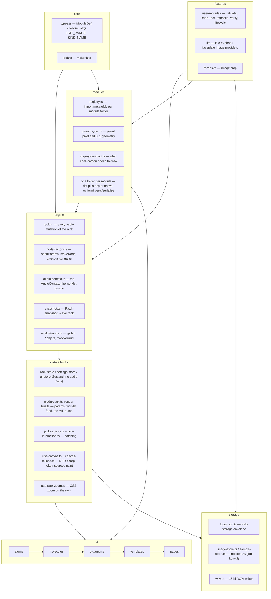

# System Architecture

Signaly is a 2D modular synthesizer that runs entirely in the browser: 101 built-in Eurorack-style
modules, patch cables, saved patches, a stereo WAV recorder, and a BYOK LLM module builder. No
backend, no accounts.

## Stack

Runtime dependencies only: **react** 19, **react-dom** 19, **zustand** 5, **sucrase** 3,
**idb-keyval** 6. Build/test tooling: Vite 8, TypeScript 6 (strict, `noUncheckedIndexedAccess`),
Vitest 4, ESLint 10 + typescript-eslint, Prettier 3. Nothing else ships to the browser.

## Layers

## Invariants

- **Audio nodes live on `ModuleInstance`, outside React.** `engine/types.ts`'s `ModuleInstance`
  holds `node`, `jacks`, `natives`, `cvGains`, `ext` — React never clones or re-renders through it.
- **The store is pure.** `state/rack-store.ts` holds rows, module instances and cables as plain data
  and calls no Web Audio API.
- **`engine/rack.ts` owns the rack's audio mutations.** Adding, removing, duplicating and moving a
  module, connecting and disconnecting a cable, pushing a param or a switch, and tearing a module
  down all go through it. It is not the only file that touches Web Audio, by design:

  | file                                  | why it touches Web Audio                                                                         |
  | ------------------------------------- | ------------------------------------------------------------------------------------------------ |
  | `engine/audio-context.ts`             | owns the single `AudioContext` and loads the worklet bundle once                                 |
  | `engine/node-factory.ts`              | constructs the `AudioWorkletNode` and the attenuverter `GainNode`s that `rack.ts` then drives    |
  | the seven `*.native.ts`               | a native module _is_ a hand-built Web Audio graph                                                |
  | `hooks/module-api.ts`                 | owns `node.port.onmessage` (one dispatcher per node fanning the feed out), and the CV-marker tap |
  | `features/user-modules/lifecycle.ts`  | `audioWorklet.addModule` on the live context, to load a user module's blob                       |
  | `features/user-modules/dsp-verify.ts` | renders a candidate DSP in an `OfflineAudioContext` before it is trusted                         |
  | `storage/sample-store.ts`             | `decodeAudioData` for the samples SAMPLER, SLICER and CLOUD load                                 |
  | `ui/templates/rack-workspace.tsx`     | creates and resumes the context on the first pointer or key gesture, which browsers require      |

- **One cable per input jack.** `connectCable` in `rack.ts` disconnects any existing cable on the
  destination jack before wiring the new one.
- **Attenuverter is a `GainNode` on `attenuates` inputs.** `installCvAttenuverters` in
  `node-factory.ts` inserts a `GainNode` between a CV input's own jack and its module target when
  `KnobDef.attenuates` names that jack, and `rack.setParam` drives that gain. A jack carries at most
  one. The value is still pushed as a param — a native module may render it (`volt`'s readout) — but
  no worklet DSP reads an attenuverting knob's id.
- **Per-frame data never enters React state.** Scopes, meters, CV markers and cable geometry are
  drawn off a single `requestAnimationFrame` pump in `hooks/render-bus.ts` (`addDraw`/`runDraws`),
  started lazily on the first subscriber and stopped when the last one leaves.
- **A worklet input cannot tell "no cable" from "a cable carrying silence".** `ch(I, n)` returns
  `null` for an unpatched input but a zero-filled buffer for a patched, silent one. Nothing depends
  on the difference today: MIX 8's returns are aux returns that add into the main bus at their
  level, so an unpatched return and a patched silent one both contribute nothing.
- **Worklet bundle is loaded via `?worker&url`.** `audio-context.ts` imports
  `worklet-entry.ts?worker&url` — `new URL(..., import.meta.url)` is broken under a Vite build (the
  raw `.ts` ships as an asset and the glob never expands).
- **Rows have fixed HP capacity, but adding a module is never blocked.** `settings.rowWidthHp`
  (default 120, 120–240) is enforced by `fits()` in `rack.ts`. `addModule` and `duplicateModule`
  spill into the row directly beneath a full one, or insert a new row there, rather than refusing;
  `moveModule` (the drag path) still refuses, because the user aimed at that row. `checkDef` rejects
  an `hp` above `MIN_ROW_HP` (120), so no module is ever unplaceable. See
  `docs/adr/0002-adding-a-module-is-never-blocked-by-a-full-row.md`.

## Module contract

A module is a folder under `src/modules/<id>/`, picked up by `modules/registry.ts` through one
`import.meta.glob` per file kind — nothing to register by hand, and nothing counts the modules:
`tests/module-catalog.test.ts` holds no id list and no total.

| file                | purpose                                                                                                                                                |
| ------------------- | ------------------------------------------------------------------------------------------------------------------------------------------------------ |
| `<id>.def.ts`       | required. `ModuleDef`: id, name, sub, hp, cat, knobs/switches/jacks, `worklet` xor `native`, optional `display`, `screen`, `leds`, `panel`, `look`     |
| `<id>.dsp.ts`       | worklet DSP class extending `Base` (`dsp-prelude.ts`), `registerProcessor(id, Class)`. 94 of them                                                      |
| `<id>.native.ts`    | a plain Web Audio graph instead of a worklet. Seven: `kbd`, `mix`, `mult`, `out`, `scope`, `voct`, `volt`                                              |
| `<id>.serialize.ts` | optional. `save`/`load`/`validate` for module-specific `ext` state saved in a Patch (`seq`, `seq16`, `trigseq`, `cvrec`, `sampler`, `slicer`, `cloud`) |
| `<id>.parts.tsx`    | optional. React UI that fills the screen box; pairs with `screen: true`                                                                                |

Four rules about a def, each of which replaced a class of silent bug:

- **Params are seeded from the def, not from the DSP.** `seedParams(def, live?)` in
  `engine/node-factory.ts` is the only source of a processor's `this.p`: every knob and switch id
  mapped to the instance's value, or the def's `initial`. The live rack seeds through it and so does
  `dsp-verify.ts`'s offline render. No `.dsp.ts` overrides `Base.defaults()`; the hook remains on
  `Base` for state a definition cannot describe.
- **`fmt` is required on every `KnobDef`.** It is the unit and, for `fInt`/`fRate`/`fKey`/`fChord`/
  `fShape`, the quantisation while dragging (`hooks/formatters.ts`). `FMT_RANGE` in `core/types.ts`
  bounds the [min, max] each name implies and `checkDef` rejects a knob outside it. `fMs` reads the
  value as seconds and `fMsec` as milliseconds; `fHz` is signed, ±22050.
- **An attenuverter is declared by `att(jack, label, id?)`** from `core/types.ts`. It is the whole
  declaration, fixed ±1 range included; the id defaults to `<jack>A`. `cvIn` on the modulated knob is
  the display hint that pairs the two. Every attenuverter in `src/modules` uses it.
- **A native fills every declared jack.** `NativeSpec.audio(m)` fills `m.jacks.in`/`m.jacks.out` by
  id and pushes its nodes onto `m.natives`; `makeNode` throws when a declared jack is left unfilled,
  because `wireCable` and the attenuverter install both skip one silently. `param(m, id, v)` receives
  knob and switch changes, `onConnectionChange` and `dispose` are optional. Only built-ins can be
  native.

Panel node ids follow a fixed prefix convention: `knob:<id>`, `fader:<id>`, `switch:<id>`,
`in:<jackId>`, `out:<jackId>`, `led:<id>`, `label:<text>`, and a single `display:<kind>` —
`display:screen` for a module that reserves its screen with `screen: true`.

## Panel geometry

`modules/panel-layout.ts` owns panel geometry in both currencies:

- **Pixels.** `HP_PX` (26), `PANEL_H` (658), `JACK_D_PX` (37), `FADER_W_PX`, `FADER_PAD_PX` and
  `MIN_CONTROL_PX` live there and nowhere else. `src/main.tsx` publishes `--hp`, `--u`, `--panel-h`,
  `--jack-d`, `--fader-w` and `--fader-pad` on `:root` at boot, so CSS reads the TypeScript constant
  instead of restating it.
- **Fractions.** `layoutPanel(def)` returns 0..1 `PanelNode`s, memoised per def id (`forgetPanel(id)`
  drops one when a user module is re-authored under the same id). Authored `ModuleDef.panel` geometry
  wins outright; two built-ins author their own — `mix8`, whose console strips the grid cannot
  express, and `tube`, whose valve is the panel's subject. See
  `docs/adr/0001-panel-geometry-computed-by-default.md`.

`fitPanel(def, maxHp)` is the single verdict on whether a def lays out and, if not, the narrowest HP
that would. `check-def.ts` asks it and nobody re-derives its bands; authored panels are checked node
by node instead, including the fader minimum.

`--u` is `calc(var(--hp) / 26)`, and every hardware dimension in the stylesheets is a multiple of it.
It is a unit, not a zoom: `--hp` is set once at boot and never changes, so `--u` is always one pixel.
Changing `HP_PX` changes the base size of the hardware in one place. Type, 1px hairlines, the jack's
ring widths and the ≥44px pointer targets are deliberately not in `--u`; the custom-property contract
is written out in the header of `src/styles/controls.css`. See
`docs/adr/0005-the-rack-zooms-with-css-zoom-and-u-is-a-unit.md`.

## Rack zoom and layout

The rack has one scaling mechanism: CSS `zoom: var(--rack-zoom)` on `.rack-scroll` (`styles/rack.css`).
`hooks/use-rack-zoom.ts` sets `--rack-zoom` from `settings.zoom` (0.2 to 1000, remembered), driven by
a two-finger pinch, ctrl or cmd with the wheel, and the − / + dock (`ui/molecules/zoom-controls.tsx`).
Only the rack zooms, never the chrome. Container queries measure unzoomed widths, so the panel
breakpoints keep their meaning at every level, and a zoom change re-renders no panel.

- **One scroller.** `.rack-scroll` is the single scroll region for every row, so rows cannot slide
  out from under each other or from under the viewport-fixed cable canvas.
- **Phone layout.** The topbar and status line share one sticky `.rack-head`. Under
  `max-width: 700px` the topbar becomes a single scrolling line and the rack pads its bottom clear of
  the zoom dock (`styles/rack.css`).
- **Rects under zoom.** Engines disagree about what `getBoundingClientRect` reports inside a zoomed
  box. `jackSpace` in `ui/molecules/cable-overlay.ts` measures the rack's painted width against its
  layout width and returns a correction only when the two disagree. Anything that turns an element's
  rect into rack coordinates should go through it.
- **Touch targets.** Jacks and faders are not grown under `pointer: coarse`; the ≥44px pseudo-element
  targets are the touch affordance. Rack zoom shrinks those targets with everything else, so the 44px
  floor holds at the default zoom and not below it. See
  `docs/adr/0006-touch-devices-get-bigger-targets-not-bigger-hardware.md`.

## Display contract

`ModuleInstance.ext` is `Record<string, unknown>` — a deliberately untyped escape hatch for audio
objects that must live outside React. Typing it would mean a union of every module's private state in
`engine/types.ts`.

**The contract is code: `src/modules/display-contract.ts`.** `DISPLAY_CONTRACT` holds one `DisplayRow`
per `Display` kind: a `needs` sentence and up to two checks, `fromDef` (decidable from the definition)
and `fromLive` (decidable only from a running instance). `whyNotReady(def, m)` returns the first
failure or `null`, and both halves of the system ask it:

- `features/user-modules/check-def.ts` calls it with `m = null`, so a def that declares a screen it can
  never fill is rejected, for built-ins and user modules alike.
- `DisplayNode` in `ui/organisms/module-panel-node.tsx` calls it live and, when it fails, renders a
  visible `NO <DISPLAY>` placeholder carrying the reason instead of an empty screen.

`ModuleDef.screen?: boolean` reserves the screen box without naming a renderer, for a module whose
`.parts.tsx` fills it. Nine built-ins do: `cloud`, `cvrec`, `sampler`, `seq`, `seq16`, `slicer`,
`trigseq`, `tube`, `wavrec`. Declaring both `screen` and `display` is a contract error. Read
`display-contract.ts` for what each kind needs; this document does not restate the rows.

A `led:<id>` panel node is separate and untyped in the same way: it lights on `{ t: 'led', id, v }`
and toggles on any `{ t: 'step' }`.

## Patching

`hooks/jack-registry.ts` maps `<uid>:<dir>:<jackId>` to the live `.jack` element, its `JackDef` and a
cached screen centre. It is the only place that measures a jack (`jackCenter`, cleared by
`invalidateJackRects`) and the only place that toggles the `.compat` glow.

`hooks/jack-interaction.ts` is the patching module — keyboard `armJack`/`cancelArm`, `unpatchJack`,
`disconnectAt`, and the pointer `beginDrag`, including grabbing a patched input to continue from its
source. Every entry point reports an `Outcome` naming the jacks involved as `JackRef`s (uid,
direction, the whole `JackDef`), and interested parties `subscribe()`. The screen-reader announcer in
`ui/templates/rack-workspace.tsx` is one of them, which is how it can say _"Patched VCO OUT to FILTER
IN, audio"_. The same file's store subscription announces module and row changes and deliberately
does not diff cables.

## Cables and canvas paint

`ui/molecules/cable-overlay.ts` is DOM-free. `overlayView(input)` turns cables, the in-progress drag
and the pointer into `Seg`s plus a hover id and a repaint signature. It holds one rope formula, the
per-cable sag and shade jitter (a hash of the cable id, so a patch draws the same tangle every load),
the hit test, and every metric scaled by the live zoom. Its hit test yields to controls, so a cable
lying over a knob loses, and it runs only when the input says `moved`; otherwise the previous frame's
hover is reused, so an idle rack samples no ropes. It also owns two rules the canvas applies:

- `jackSpace` — the rect correction under CSS zoom, above.
- `clickRemovesCable(press)` — a click removes the hovered cable only when its press began away
  from the controls and travelled no more than `CLICK_SLOP` px. A control holds pointer capture, so
  the click that ends a knob drag would otherwise reach the window over whatever cable the cursor
  drifted onto.

`ui/molecules/cable-canvas.tsx` is the painter: it tracks the press in capture-phase window
listeners, builds the view, skips the repaint when the signature is unchanged, and strokes each `Seg`.
It raises `moved` on pointer move, leave, down, up and cancel, and on everything that can slide a
cable under a still pointer — a rack mutation, a zoom change, a window resize or scroll, a visual
viewport resize or scroll — which also drops the cached jack centres.
`hooks/use-canvas.ts` keeps any canvas DPR-sharp (capped at 2), resizes it, and registers its paint on
the render bus.

`hooks/canvas-tokens.ts` `readTokens(el?)` reads the design tokens a canvas needs off an element —
element-scoped ones like `--cat` included — and caches per element until `use-canvas` invalidates on
resize. `TOKEN_FALLBACK` restates the `tokens.css` values for when the stylesheet has not resolved;
`canvas-tokens.test.ts` fails on drift.

## Dialogs

`ui/molecules/modal-dialog.tsx` — `{ label, onClose, children }` — owns the modal contract: backdrop
and backdrop dismiss, Escape, initial focus, a focus trap whose focusable list is re-queried on every
Tab, and focus restore to whatever had focus at open. The settings, patch and module-browser dialogs
supply only their contents.

## User-module pipeline

`features/user-modules/lifecycle.ts` is the whole life of a user module:

| call           | what it does                                                                                                                            |
| -------------- | --------------------------------------------------------------------------------------------------------------------------------------- |
| `install(um)`  | validate, transpile, verify, load, register, then persist — nothing is stored that the runtime refused. Mints a fresh `updatedAt` first |
| `activate(um)` | the same up to register, without storing — what the builder previews                                                                    |
| `check(um)`    | would this install? Validate, transpile, render offline, answer with a message or `null`                                                |
| `remove(slug)` | storage, registry, memoised panel and faceplate image together                                                                          |
| `restoreAll()` | boot path: put every stored module back in the registry without re-verifying. Returns the slugs that did not come back                  |
| `list()`       | the stored records                                                                                                                      |

Validation is step one of every way in: `parse` round-trips the module through the stored record
shape (`fromRecord(toRecord(um))`), so the untrusted-input parser is always in front.

1. **Transpile** (`dsp-transpile.ts`): sucrase strips TypeScript, a `FORBIDDEN` regex rejects
   `eval`/`Function`/`importScripts`/`fetch`/`window`/`document`/`localStorage`/`globalThis` etc.,
   author `import` lines are stripped, and the real `dsp-prelude.ts` (transpiled once) is inlined
   ahead of the author's code so worklet scope can never drift from the built-in one. The regex is
   defence in depth, not the boundary — see Security boundaries below.
2. **Verify offline** (`dsp-verify.ts`): render the processor, seeded by `seedParams`, in an
   `OfflineAudioContext`, scanning the output for NaN, Infinity and samples past `MAX_ABS` within a
   3 s timeout. The context is closed afterwards, but a worklet stuck in an infinite loop cannot be
   pre-empted from the main thread; only a reload clears that render thread.
3. **Load live**: the built code is blobbed and passed to `audioWorklet.addModule(blobUrl)`.
4. **Register**: `registerSpec` adds it to the same registry map as built-ins, and `forgetPanel`
   drops any memoised layout under that id.

The processor name is bumped on every edit — `user:<slug>@<updatedAt>` — because a live
`AudioContext` can never un-register a processor name.

**Restore at boot.** `ui/pages/rack-page.tsx` runs `restoreAll()` once the worklet bundle loads,
without blocking the rack from rendering; nothing loads a Patch at boot, so nothing races it. It
imports `lifecycle.ts` dynamically, and only when `listUserModules()` is non-empty, because the
lifecycle module pulls in the DSP transpiler and a static import put sucrase in the chunk every
visitor downloads. `BuilderPage` is `lazy()` in `src/app.tsx` for the same reason. A module that
fails to come back is named in a notice. Restore does not re-verify:
`docs/adr/0003-restoring-a-stored-user-module-does-not-re-verify-its-dsp.md`.

A Patch references its user modules and never carries them
(`docs/adr/0004-a-patch-references-its-user-modules-it-never-carries-them.md`). `applySnapshot`
returns the `mtype`s nothing is registered for, and `ui/organisms/patch-menu.tsx` raises _"Not
installed: … — those modules and their cables were skipped."_

## Validation: two files, one split

- **`features/user-modules/check-def.ts` — `checkDef(def)`** is the single answer to "is this
  `ModuleDef` well-formed": knob ranges and `FMT_RANGE`, attenuverter targets, the one shared
  knob/switch id namespace, at least one option per switch (a one-option switch is a push-button
  toggle, like MIX 8's M, S and PRE), duplicate jacks and panel nodes, LED ids, `whyNotReady`, the
  `hp` ceiling, and the panel verdict. Its two callers are `validateUserDef` and
  `tests/module-contract-sweep.test.ts`, which runs it over every built-in.
- **`features/user-modules/validate.ts`** is the untrusted-input parser in front of it: types, string
  lengths, list caps — bounds that exist only because the input is LLM output or an imported file. It
  coerces a loose object into a `UserDef` and then calls `checkDef`. It does not accept `screen`: a
  user module has no `.parts.tsx` to fill one.

## Styling seams

- **Maker kits.** `ModuleDef.look` names a kit in `src/core/look.ts` — faceplate finish, knob, switch,
  header, silkscreen, type and jack style. `KnobDef.look` and `SwitchDef.look` override one control. A
  def with no `look` falls back to `CAT_KIT[cat]`. `ui/organisms/module-panel.tsx` puts the kit on the
  panel as `data-*` attributes (`data-plate` among them) for `faceplates.css`, `knobs.css`,
  `silkscreen.css` and `hardware.css`.
- `module-panel.tsx` also sets `data-def-id` on `.module-panel`, a per-module styling hook; no
  stylesheet reads it today.
- **Screws** are one `.screws` element per panel painted as background layers (`styles/panel.css`):
  four at full width, two on a diagonal once the panel is 4 HP or narrower.
- **Forced colours.** `src/styles/base.css` carries the only `forced-colors: active` block: an
  `outline` on `:focus-visible` (the global focus `box-shadow` is stripped in that mode), and a
  `CanvasText` border on the elements whose whole appearance is paint — knobs, knob caps, faders,
  fader caps, LEDs, piano keys and two live-data bars. System colours only, because a `var()` is
  substituted away with everything else.
- **Colour vision.** `src/styles/cvd-palette.test.ts` reads the four Signal Kind tokens, simulates
  protan, deutan and tritan with the per-cable shade included, and fails naming the closest pair when
  a CIE76 distance drops below its budget.
- **TS↔CSS seam.** `src/styles/control-geometry.test.ts` checks that `--u`, `--panel-h` and the art
  widths are published from the `panel-layout.ts` constants, that the knob sweep, fader cap and piano
  black-key width are each one token every dependent reads, the screw layers, the forced-colours
  block, and that no coarse-pointer block resizes a control the layout packs to. `vite.config.ts`
  includes those stylesheets as text in tests, or the guards would read empty strings.

## Tests

`npx vitest run` runs 1163 tests across 130 files. Three cover every module rather than a chosen few:

- `tests/module-contract-sweep.test.ts` — `checkDef` over every built-in, exactly one implementation
  route per def, the screen/parts pairing, declared LEDs posted, declared inputs read and outputs
  written.
- `tests/dsp-smoke-sweep.test.ts` — every `.dsp.ts` runs 64 blocks unpatched, with silence, and with
  a plausible signal on each input, and must stay finite and within `MAX_ABS`. The bound is read out
  of `dsp-verify.ts`'s source, so a built-in clears the same floor as an AI-generated user module.
- `tests/example-patches.test.ts` — every bundled Patch checked against the registry.

`tests/dsp-harness.ts` makes the smoke sweep possible: `loadProcessor(slug, over?)` stubs the
worklet globals, evaluates the `.dsp.ts`, and returns an instance seeded by `seedParams` from the
module's own def, with `over` standing in for a moved control. `dspSlugs()` enumerates the DSPs, so a
new module joins the sweep by existing.

## BYOK (bring your own key)

One API key per provider (`storage/api-key-store.ts`, Anthropic/OpenAI/Gemini), stored in
`sessionStorage` unless `settings.rememberKeys` is on. Model ids are not secret and stay in
`localStorage` either way; keys already in `localStorage` from before the change are kept there and
set `rememberKeys` to true, so nothing on disk is silently orphaned. Gemini's key is sent as the
`x-goog-api-key` header rather than a `?key=` query parameter, keeping it out of devtools and HAR
exports. Every provider request carries an `AbortSignal.timeout`, so a provider that never answers
fails with a deadline message instead of leaving the builder waiting forever. Chat requests force
structured output per provider (`features/llm/providers/`): Anthropic uses a forced tool call, OpenAI
uses `json_schema`, Gemini uses `responseSchema`. No streaming — one request, one parsed
`ModuleProposal`. Faceplate image generation is supported by OpenAI and Gemini only.

## Storage

`storage/local-json.ts` wraps every value in a versioned envelope `{ v: 1, data }` and takes the
`Storage` object as an argument, so one envelope serves both web-storage areas. Malformed,
wrong-version or wrong-shape payloads fall back silently; writes swallow quota/private-mode failures.

| area             | keys                                                                                  | holds                                                                                                                                          |
| ---------------- | ------------------------------------------------------------------------------------- | ---------------------------------------------------------------------------------------------------------------------------------------------- |
| `localStorage`   | `signaly.{patches,settings,user-modules}.v1`, and `signaly.api-keys.v1` for model ids | patches with their tags, settings (row width, zoom), user-module definitions and DSP source, provider model ids                                |
| `sessionStorage` | `signaly.api-keys.v1`                                                                 | provider API keys — the default, so closing the tab forgets them. They live in `localStorage` instead only while `settings.rememberKeys` is on |
| IndexedDB        | `idb-keyval` store                                                                    | faceplate image blobs (`image-store.ts`) and loaded samples (`sample-store.ts`)                                                                |

- **The rack itself is not persisted.** Only patches, settings, API keys and user modules have keys.
- **Patch tags** (genre, tempo, key) are an optional `tags` array on a Patch, sanitised on the way in
  and out (`storage/patch-store.ts`).
- **WAV REC's take** lives on its module's `ext` in memory, as 16-bit samples, and leaves the app
  only as a download written by `storage/wav.ts`.
- **The origin, not the app, is the storage boundary.** On GitHub Pages every project site under one
  account shares `https://<user>.github.io`, so a script on any of them can read these keys.
  Session-only keys shrink the window; only a custom domain closes it.
- `clearImages()` is a plain named export; the "delete everything" path calls it instead of
  dynamically importing `idb-keyval` a second time.

## Build, CI and deploy

- `.github/workflows/gate.yml` is the single definition of a releasable tree: `format:check`, `lint`,
  `typecheck`, `test`, `build`, then `npm audit --audit-level=high`, which fails on a real advisory
  and warns after three attempts when the advisory service is unreachable.
- `ci.yml` calls the gate on every pull request and on pushes to `master`.
- `release.yml` re-runs the gate when a GitHub release is published, builds with
  `npx vite build --base="/<repo>/"` and deploys to GitHub Pages. A merge never deploys; a release
  does, so the live site at `https://modularmechanic.github.io/signaly/` always corresponds to a tag.
- The production bundle splits `react`/`react-dom` into a vendor chunk, the worklet bundle into its
  own chunk, and the builder and user-module lifecycle into lazily loaded chunks.

## Security boundaries

- CSP (`index.html`), as shipped: `default-src 'self'`; `script-src 'self' blob:` and
  `worker-src 'self' blob:` (user modules compile in the page and register from a blob URL — that is
  the sandbox, not a hole); `connect-src 'self'` plus exactly the three LLM provider hosts;
  `img-src 'self' blob: data:`; `style-src 'self' 'unsafe-inline'` (React sets styles through CSSOM
  and the app has no HTML sink, so dropping it buys nothing); `object-src 'none'`; `base-uri 'self'`;
  `form-action 'none'`. `frame-ancestors` is deliberately absent: the spec ignores it in a meta CSP
  and browsers warn on every load; it needs a response header, which GitHub Pages cannot send.
- A React error boundary plus `error` / `unhandledrejection` handlers in `main.tsx` turn a render
  exception into a recoverable message rather than a blank page.
- API keys and error text are scrubbed (`features/llm/providers/http.ts`'s `scrub`) before ever
  reaching a thrown error or log.
- All imported/stored JSON (patches, user modules, API key state) is validated on read; malformed
  data degrades to a safe default rather than throwing.
- User DSP is never `eval`'d on the main thread — it only ever runs inside an `AudioWorkletProcessor`
  in the audio rendering thread, after the offline verification pass above.
- **User-DSP threat model, stated plainly.** The sandbox is the AudioWorklet scope (no DOM, no
  network by spec) plus the CSP. The `FORBIDDEN` regex is defence in depth and is deliberately not
  sound: `globalThis["eval"]`, aliasing `eval` to a variable, and dynamic `import()` all get past it.
  Because user modules can be exported and imported, running a hostile module file from a third party
  is a real path; its damage ceiling is wedging the user's own tab, which a reload fixes.
