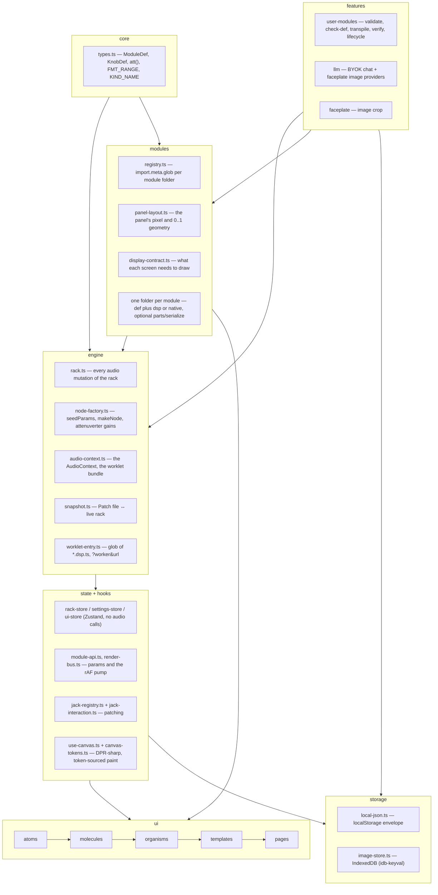

# System Architecture

Signaly is a 2D modular synthesizer that runs entirely in the browser: 41 built-in Eurorack-style
modules, patch cables, saved patches, and a BYOK LLM module builder. No backend, no accounts.

## Stack

Runtime dependencies only: **react** 19, **react-dom** 19, **zustand** 5, **sucrase** 3,
**idb-keyval** 6. Build/test tooling: Vite 8, TypeScript 6 (strict, `noUncheckedIndexedAccess`),
Vitest 4, ESLint 10 + typescript-eslint, Prettier 3. Nothing else ships to the browser.

## Layers

## Invariants

- **Audio nodes live on `ModuleInstance`, outside React.** `engine/types.ts`'s `ModuleInstance`
  holds `node`, `jacks`, `natives`, `cvGains`, `ext` — React never clones or re-renders through it.
- **The store is pure.** `state/rack-store.ts` holds rows, module instances and cables as plain
  data and calls no Web Audio API at all. It is a container for instances, not a builder of them.
- **`engine/rack.ts` owns the rack's audio mutations.** Placing, removing, duplicating and
  restoring a module, connecting and disconnecting a cable, pushing a param or a switch, and
  tearing a module down all go through it, and the invariants below are its to keep. It is not
  the only module that touches Web Audio, and never was — these do too, by design:

  | file | why it touches Web Audio |
  |---|---|
  | `engine/audio-context.ts` | owns the single `AudioContext` and loads the worklet bundle once; every other file asks it for the context |
  | `engine/node-factory.ts` | constructs the `AudioWorkletNode` and the attenuverter `GainNode`s that `rack.ts` then drives |
  | the seven `*.native.ts` | a native module *is* a hand-built Web Audio graph — that is the whole point of the route |
  | `hooks/module-api.ts` | owns `node.port.onmessage` — one shared dispatcher per node fanning the worklet feed out to many React subscribers — and hands back a poster |
  | `features/user-modules/lifecycle.ts` | `audioWorklet.addModule` on the live context, to load a user module's blob |
  | `features/user-modules/dsp-verify.ts` | the same call on an `OfflineAudioContext`, to render a candidate DSP before it is trusted |

- **One cable per input jack.** `connectCable` in `rack.ts` disconnects any existing cable on the
  destination jack before wiring the new one.
- **Attenuverter is a `GainNode` on `attenuates` inputs.** `installCvAttenuverters` in
  `node-factory.ts` inserts a `GainNode` between a CV input's own jack and its module target when
  `KnobDef.attenuates` names that jack; `rack.setParam` drives the gain directly and the knob value
  never reaches the DSP. A jack carries at most one — a second gain would swallow the first.
- **Per-frame data never enters React state.** Scopes, meters, and cable geometry are drawn off a
  single `requestAnimationFrame` pump in `hooks/render-bus.ts` (`addDraw`/`runDraws`), started
  lazily on first subscriber and stopped when the last one leaves.
- **A worklet input cannot tell "no cable" from "a cable carrying silence".** `ch(I, n)` returns
  `null` for an unpatched input but a zero-filled buffer for a patched, silent one. MIX 8's insert
  returns use that as the bypass test, so an unpatched return correctly bypasses while a patched but
  silent return mutes the bus. This is accepted behaviour, and matches a real console insert.
- **Worklet bundle is loaded via `?worker&url`.** `audio-context.ts` imports
  `worklet-entry.ts?worker&url` — `new URL(..., import.meta.url)` is documented as broken under a
  Vite build (the raw `.ts` ships as an asset and the glob never expands).
- **Rows have fixed HP capacity, but adding a module is never blocked.** `settings.rowWidthHp`
  (default 120, 120–240, user-adjustable) is enforced by `fits()` in `rack.ts`. `addModule` and
  `duplicateModule` spill into the row beneath a full one, or insert a new row, rather than
  refusing; `moveModule` (the drag path) still refuses, because the user aimed at that specific
  row. `MIN_ROW_HP` (120) is wider than the widest built-in, so no module is ever unplaceable. See
  `docs/adr/0002-adding-a-module-is-never-blocked-by-a-full-row.md`.

## Module contract

A module is a folder under `src/modules/<id>/`, picked up by `modules/registry.ts` via
`import.meta.glob('./*/*.def.ts', …)` and its sibling globs — nothing to register by hand.

| file | purpose |
|---|---|
| `<id>.def.ts` | required. `ModuleDef`: id, name, sub, hp, cat, knobs/switches/jacks, `worklet` xor `native`, optional `display`, `screen`, `leds`, `panel` |
| `<id>.dsp.ts` | worklet DSP class extending `Base` (`dsp-prelude.ts`), `registerProcessor(id, Class)`. 34 of them |
| `<id>.native.ts` | alternative to `.dsp.ts` for a plain Web Audio graph. Seven: `kbd`, `mix`, `mult`, `out`, `scope`, `voct`, `volt` |
| `<id>.serialize.ts` | optional. `save`/`load`/`validate` for module-specific `ext` state (only `seq`) |
| `<id>.parts.tsx` | optional. Extra React UI that takes the screen box; pairs with `screen: true` (`mix8`, `seq`) |

Three rules about a def are worth stating because each replaced a class of silent bug:

- **Params are seeded from the def, not from the DSP.** `seedParams(def, live?)` in
  `engine/node-factory.ts` is the only source of a processor's `this.p`: every knob and switch id
  mapped to the instance's value, or the def's `initial`. The live rack seeds through it and so does
  `dsp-verify.ts`'s offline render, so the two can never disagree. No `.dsp.ts` overrides
  `Base.defaults()` — the hook still exists on `Base` for state a definition cannot describe, and
  nothing needs it today.
- **`fmt` is required on every `KnobDef`.** It is the unit *and*, for the integer-stepped names, the
  quantisation while dragging. `FMT_RANGE` in `core/types.ts` bounds the [min, max] each name
  implies, and `checkDef` rejects a knob that leaves those bounds.
- **An attenuverter is declared by `att(jack, label, id?)`** from `core/types.ts` — 62 uses across
  28 defs. It is the whole declaration, fixed ±1 range included, so the four numbers live in one
  place. `cvIn` on the modulated knob is the display hint that pairs the two.

Panel node ids follow a fixed prefix convention: `knob:<id>`, `fader:<id>`, `switch:<id>`,
`in:<jackId>`, `out:<jackId>`, `led:<id>`, `label:<text>`, and a single `display:<kind|screen>`.

## Panel geometry

`modules/panel-layout.ts` is the sole owner of panel geometry, in both currencies:

- **Pixels.** `HP_PX` (26), `PANEL_H` (658), `JACK_D_PX`, `FADER_W_PX`, `FADER_PAD_PX` and
  `MIN_CONTROL_PX` live there and nowhere else. They used to sit in `core/types.ts` with the
  stylesheets restating them. `src/main.tsx` publishes each on `:root` at boot, so CSS reads the
  TypeScript constant instead of agreeing with it by comment.
- **Fractions.** `layoutPanel(def)` returns 0..1 `PanelNode`s, memoised per def id
  (`forgetPanel(id)` drops one when a user module is re-authored under the same id). Authored
  `ModuleDef.panel` geometry wins outright; every built-in uses the computed layout. See
  `docs/adr/0001-panel-geometry-computed-by-default.md`.

`fitPanel(def, maxHp)` is the single verdict on whether a def lays out, and if not, the narrowest HP
that would. `check-def.ts` asks it and nobody re-derives its bands. `computePanel`'s final 0..1 clamp
decides nothing — it is a backstop so a def that slipped past `fitPanel` still cannot render garbage
coordinates.

`--u` — `calc(var(--hp) / HP_PX)` — is the rack's scaling unit, published from `main.tsx` alongside
the widths above. Every hardware dimension in `panel.css` / `controls.css` / `cables.css` is a
multiple of it, so setting `--hp` alone rescales the instrument with its ratios intact. Type, 1px
hairlines, the jack's ring widths and the ≥44px pointer targets are deliberately *not* in `--u`; see
`docs/adr/0005-the-rack-scales-by-hp-but-type-and-pointer-targets-do-not.md` and
`docs/adr/0006-touch-devices-get-bigger-targets-not-bigger-hardware.md`.

## Display contract

`ModuleInstance.ext` is `Record<string, unknown>` — a deliberately untyped escape hatch for audio
objects that must live outside React. It stays untyped: typing it would mean a union of every
module's private state in `engine/types.ts`.

**The contract is code: `src/modules/display-contract.ts`.** It holds one `DisplayRow` per `Display`
kind, each with a `needs` sentence (the module's side of the bargain, in author-facing words) and up
to two checks — `fromDef`, decidable from the definition alone, and `fromLive`, decidable only from a
running instance. `whyNotReady(def, m)` returns the first failure or `null`, and both halves of the
system ask it:

- `features/user-modules/check-def.ts` calls it with `m = null`, so a def that declares a screen it
  can never fill is rejected at authoring time, for built-ins and user modules alike.
- `DisplayNode` in `ui/organisms/module-panel-node.tsx` calls it live and, when it fails, renders a
  visible `NO <DISPLAY>` placeholder carrying the reason. A missing feed used to draw nothing at all
  — which is how MAIN OUT shipped with `SPECTRUM`/`PHASE` switches wired to an analyser no renderer
  read.

`ModuleDef.screen?: boolean` reserves the screen box without naming a renderer, for a module whose
`.parts.tsx` fills it. Declaring both is a contract error, so `mix8` and `seq` no longer name a
`display` kind they never render.

Read `display-contract.ts` for what each kind needs; this document deliberately does not restate the
rows, because a prose copy is exactly what drifted before.

A `led:<id>` panel node is separate and untyped in the same way: it lights on `{ t: 'led', id, v }`
and toggles on any `{ t: 'step' }`. `tests/module-contract-sweep.test.ts` greps each DSP's source
for the posts that match its declared `leds`, so a declared LED that can never light fails the sweep.

## Patching

`hooks/jack-registry.ts` is the map from `<uid>:<dir>:<jackId>` to the live `.jack` element, its
`JackDef`, and a cached screen centre. It is the only place that measures a jack
(`getBoundingClientRect` per jack per frame is the cable overlay's whole frame budget) and the only
place that toggles the `.compat` glow.

`hooks/jack-interaction.ts` is the patching module itself — keyboard arm/cancel (`armJack`,
`cancelArm`), `unpatchJack`, `disconnectAt`, and the pointer drag (`beginDrag`, including the
grab-a-patched-input-and-continue-from-its-source case). It replaced `hooks/patch-state.ts`.

Every entry point returns an `Outcome` that names the jacks involved as `JackRef`s — module uid,
direction, and the whole `JackDef`. Interested parties `subscribe()` instead of diffing the rack.
That is why the screen-reader announcer in `ui/templates/rack-workspace.tsx` can say *"Patched VCO
OUT to FILTER IN, audio"*: it is told, in the words a person reads off the panel. The same file's
store subscription still diffs for module and row changes, and deliberately does not diff cables.

## Cables and canvas paint

`ui/molecules/cable-overlay.ts` builds the frame: `overlayView(input)` turns cables, the in-progress
drag and the pointer into `Seg`s plus a hover id and a repaint signature. It is DOM-free and holds
the geometry that used to be spread across the canvas component — one rope formula (`seg`), the
per-cable sag and shade jitter (a hash of the cable id, so a patch draws the same tangle every
load), and the hit-testing. Its hit test yields to controls, so a cable lying over a knob loses.

`ui/molecules/cable-canvas.tsx` is now a thin painter over `hooks/use-canvas.ts`: take the view,
skip the repaint when the signature is unchanged, stroke each `Seg`. `use-canvas.ts` keeps a canvas
DPR-sharp, resizes it, and registers its paint on the render bus.

`hooks/canvas-tokens.ts` `readTokens(el?)` reads the design tokens a canvas needs off an element —
element-scoped ones like `--cat` included — and caches per element until `use-canvas` invalidates on
resize. Canvas code names no literal colour; `TOKEN_FALLBACK` restates `tokens.css` verbatim for the
case where the stylesheet has not resolved, and `canvas-tokens.test.ts` fails on drift.

## Dialogs

`ui/molecules/modal-dialog.tsx` — `{ label, onClose, children }` — owns the whole modal contract:
backdrop and backdrop dismiss, Escape, initial focus, focus trap (the focusable ring is re-queried
on every Tab, because the list inside a dialog grows and shrinks) and focus restore to whatever had
focus at open. The settings, patch and module-browser dialogs supply only their contents.

## User-module pipeline

`features/user-modules/lifecycle.ts` is the whole life of a user module. It replaced
`runtime-registry.ts`'s `registerUserModule`.

| call | what it does |
|---|---|
| `install(um)` | validate, transpile, verify, load, register, **then** persist — nothing is stored that the runtime refused. Mints a fresh `updatedAt` first, because that drives the processor name |
| `activate(um)` | the same up to register, without storing — what the builder previews |
| `check(um)` | "would this install?" — validate, transpile, render offline, answer with a message or `null` |
| `remove(slug)` | storage, registry and faceplate image together; miss one and a ghost outlives the module |
| `restoreAll()` | boot path: put every stored module back in the registry. Returns the slugs that did not come back |
| `list()` | the stored records |

**Validation is step one of every way in.** `parse` round-trips the module through the stored record
shape (`fromRecord(toRecord(um))`), so there is one door and the untrusted-input parser is always
behind it.

The middle of the pipeline is unchanged in substance:

1. **Transpile** (`dsp-transpile.ts`): sucrase strips TypeScript, a `FORBIDDEN` regex rejects
   `eval`/`Function`/`importScripts`/`fetch`/`window`/`document`/`localStorage`/`globalThis` etc.,
   author `import` lines are stripped, and the real `dsp-prelude.ts` (transpiled once) is inlined
   ahead of the author's code so worklet scope can never drift from the built-in one. The regex is
   defence in depth, not the boundary — see Security boundaries below.
2. **Verify offline** (`dsp-verify.ts`): render the processor in an `OfflineAudioContext`, scanning
   output for NaN/Infinity/out-of-range samples within a timeout. The timeout bounds the UI wait and
   the context is closed in `finally`, but a worklet stuck in an infinite loop cannot be pre-empted
   from the main thread; only a reload clears that render thread.
3. **Load live**: the built code is blobbed and passed to `audioWorklet.addModule(blobUrl)`.
4. **Register**: `registerSpec` adds it to the same registry map as built-ins, and `forgetPanel`
   drops any memoised layout under that id.

The processor name is bumped on every edit — `user:<slug>@<updatedAt>` — because a live
`AudioContext` can never un-register a processor name.

`restoreAll()` runs at boot from `ui/pages/rack-page.tsx`, after the worklet bundle loads and
without blocking the rack from rendering — nothing loads a patch at boot, so the restore is free to
be in flight. It deliberately **does not** re-verify: a stored module already passed on the way in,
and verification catches authoring mistakes rather than enforcing security, which is the worklet
scope plus the CSP. See
`docs/adr/0003-restoring-a-stored-user-module-does-not-re-verify-its-dsp.md`. A module that fails to
come back is named in a notice, and one broken module never keeps the rest out.

A Patch references its user modules and never carries them
(`docs/adr/0004-a-patch-references-its-user-modules-it-never-carries-them.md`). `applySnapshot`
returns the `mtype`s nothing is registered for and `patch-menu.tsx` raises a notice — *"Not
installed: … — those modules and their cables were skipped"* — instead of dropping the module and
its cables in silence.

## Validation: two files, one split

- **`features/user-modules/check-def.ts` — `checkDef(def)`** is the single answer to "is this
  `ModuleDef` well-formed": knob ranges against `FMT_RANGE`, attenuverter targets, the one shared
  knob/switch id namespace, duplicate jacks and panel nodes, LED ids, `whyNotReady`, and the panel
  verdict from `fitPanel`. Its two callers are the user-module path and
  `tests/module-contract-sweep.test.ts`, which runs it over all 41 built-ins. A built-in and a
  user module are held to exactly the same rules.
- **`features/user-modules/validate.ts`** is the untrusted-input parser in front of it: types,
  string lengths, jack/knob/node list caps — the bounds that exist only because the input is LLM
  output or an imported file. It coerces a loose object into a `UserDef` and then calls `checkDef`.

The split is deliberate. A cap on "how many jacks may a JSON file declare" is a parser concern; "a
knob declaring `fmt: 'fHz'` may not range past 22050" is a contract concern, and only the second is
something a built-in should also have to satisfy.

## Styling seams

- `data-def-id` on `.module-panel` (set by `ui/organisms/module-panel.tsx`) is the per-module CSS
  styling seam: any module can carry panel-specific rules without a new class or a prop.
  `src/styles/mix8.css` is the one built-in that uses it.
- The custom-property contract — every property an atom's CSS may read and its one owner — is
  documented in the header comment of `src/styles/controls.css`. Read it there; it is not copied
  here.
- `src/styles/base.css` carries a `forced-colors: active` block: an `outline` on `:focus-visible`
  (the global focus `box-shadow` is stripped in that mode, which left no focus indicator at all),
  and a `CanvasText` border on the elements whose entire appearance is paint — knobs, faders, LEDs,
  piano keys, and the two live-data bars a forced background would blank.
- `src/styles/cvd-palette.test.ts` enforces the colour-vision budget on the four Signal Kind
  colours, simulating protan/deutan/tritan and measuring CIE76 distance against recorded thresholds.
  The budget was written down once and then drifted below unnoticed, because nothing measured it.
- `src/styles/control-geometry.test.ts` guards the TS↔CSS seam: that `--u`, `--panel-h`, `--jack-d`
  and the fader widths are published from the `panel-layout.ts` constants, that the knob sweep,
  fader cap and piano black-key width are each one token every dependent reads, and that no
  coarse-pointer block resizes a control the layout packs to.

## Tests

`npm test` runs 382 tests across 59 files. Two sweeps cover every module rather than a chosen few:

- `tests/module-contract-sweep.test.ts` — `checkDef` over all 41 built-ins, exactly one
  implementation route per def, the screen/parts pairing, and the declared-LED check.
- `tests/dsp-smoke-sweep.test.ts` — every `.dsp.ts` runs 64 blocks unpatched, with silence, and with
  a plausible signal on each input, and must stay finite and in range. The bound is read out of
  `dsp-verify.ts`'s source, so a built-in clears exactly the floor an AI-generated User Module has
  to clear, from one number.

`tests/dsp-harness.ts` is what makes the second possible: `loadProcessor(slug, over?)` stubs the
worklet globals, evaluates the `.dsp.ts`, and returns an instance seeded by `seedParams` from the
module's own def — the same seeding the live rack does, with `over` standing in for a moved control.
`dspSlugs()` enumerates them, so a new module joins the sweep by existing.

## BYOK (bring your own key)

One API key per provider (`storage/api-key-store.ts`, Anthropic/OpenAI/Gemini), stored in
`localStorage`. Model ids are fetched from each provider at runtime, never hardcoded. Chat requests
force structured output per provider (`features/llm/providers/`): Anthropic uses a forced tool call,
OpenAI uses `json_schema`, Gemini uses `responseSchema`. No streaming — one request, one parsed
`ModuleProposal`. Faceplate image generation is supported by Gemini and OpenAI only.

## Storage

- **localStorage**, versioned envelope `{ v: 1, data }` (`storage/local-json.ts`), under
  `signaly.*.v1` keys: `patches`, `settings`, `api-keys`, `user-modules`. Malformed or wrong-version
  payloads fall back silently; writes swallow quota/private-mode failures.
- **IndexedDB** (`idb-keyval`, `storage/image-store.ts`) for faceplate image blobs — well past
  localStorage's practical size budget.

## Security boundaries

- CSP (`index.html`): `script-src 'self' blob:` and `worker-src 'self' blob:` (worklet blobs only),
  no third-party script origins; `connect-src` allow-lists only the three LLM provider APIs;
  `form-action 'none'`.
- API keys and error text are scrubbed (`features/llm/providers/http.ts`'s `scrub`) before ever
  reaching a thrown error or log.
- All imported/stored JSON (patches, user modules, API key state) is validated on read; malformed
  data degrades to a safe default rather than throwing.
- User DSP is never `eval`'d on the main thread — it only ever runs inside an `AudioWorkletProcessor`
  in the audio rendering thread, after the offline verification pass above.
- **User-DSP threat model, stated plainly.** The sandbox is the AudioWorklet scope (no DOM, no
  network by spec) plus the CSP. The `FORBIDDEN` regex is defence in depth and is deliberately not
  sound: `globalThis["eval"]`, aliasing `eval` to a variable, and dynamic `import()` all get past it.
  Because user modules can be exported and imported, running a hostile module file from a third party
  is a real path; its damage ceiling is wedging the user's own tab, which a reload fixes.
